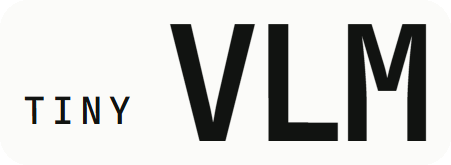
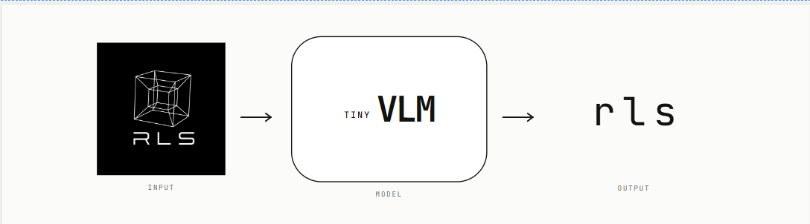

<p align="center">
  
</p>

# RLS Entrance Challenge — Tiny Vision-Language Model

RLS (Research Lab SUP'COM) is a student-led lab where members learn research by doing it: reading papers,
building systems, running experiments, and reporting what they find — including what failed.

This repository is the entrance challenge for new members. The task: build a tiny vision-language model that
looks at a generated image and spells out a one-word description of it, letter by letter.

<p align="center">
  
</p>

## What you're building

```
Image (B, 3, 64, 64)
  -> CNN encoder                         (yours)
  -> visual tokens                       (adapter: flatten + linear projection)
  -> Transformer decoder                 (yours, handwritten multi-head attention)
  -> greedy letter-by-letter decoding
  -> e.g. "largeredcircle"
```

`generate_data.py` in this repository is provided by RLS — run it with the default (fixed) seed and do not
change the split sizes. Everything else — tokenizer, CNN encoder, attention, decoder, training loop,
evaluation, and experiments — is your own implementation.

Full requirements, constraints, rubric, and timeline are in the Learning Guide and Project Brief you were
given. If anything here conflicts with those documents, the documents win.

## Getting started

```bash
pip install -r requirements.txt
python generate_data.py            # writes data/{train,val,test,test_heldout}.pt + data/meta.json
pytest                             # generator tests pass out of the box; model tests skip until src/model/ is implemented
```

## Repository layout

```
.
├── generate_data.py         # RLS-provided ShapeScenes generator — do not modify
├── configs/                 # baseline.yaml, blind.yaml, ...
├── src/
│   ├── tokenizer.py
│   ├── data.py
│   ├── model/
│   │   ├── encoder.py
│   │   ├── attention.py
│   │   ├── decoder.py
│   │   └── vlm.py
│   ├── train.py
│   ├── evaluate.py
│   └── generate.py
├── tests/
│   ├── test_attention.py       # provided: equivalence with F.scaled_dot_product_attention, masks, gradients
│   ├── test_shapes.py          # provided: tensor shapes and pipeline sanity checks
│   └── test_generate_data.py   # provided: checks generate_data.py against the spec
├── experiments/E1_blind/
├── benchmarks/S1_throughput/
└── report/
```

## Provided tests

The model tests skip until you implement `src/model/`. They only assume a few conventions, documented at the top
of `tests/test_attention.py` and `tests/test_shapes.py`: the last `nn.Module` in each `src/model/` file is its
main class; attention is `Cls(d_model, n_heads)` called as `attention(x, mask)`, with a boolean mask where `True`
means "may attend"; the encoder and the full model can be built with no arguments.

## Results

Fill in your results table here before submitting (see the Project Brief for the required format: experiment,
configuration, metric, result as mean ± std over seeds, one-sentence interpretation).

## AI usage

Document any AI tool usage in `AI_USAGE.md` — required for submission.

## Questions

Ask in the challenge channel — conceptual and requirement questions only, not "please fix my code."

## License

See [LICENSE](LICENSE).
